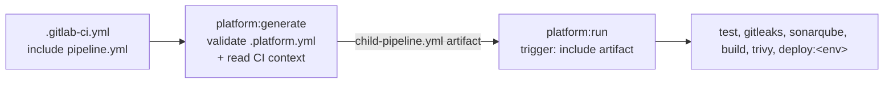

<p align="right">🇬🇧 <b>English</b> · 🇷🇺 <a href="README.ru.md">Русский</a></p>

# pipeline-platform

[](https://github.com/ftonita/pipeline-platform/actions)


**Reusable CI/CD building blocks for GitLab CI and Jenkins: Vault, Nexus, Artifactory, Docker images, Ansible. A few lines and a few parameters per repository.**

```yaml
# GitLab: the whole .gitlab-ci.yml of an Ansible role repository
include:
  - project: platform/pipeline-platform
    ref: v1
    file: [gitlab/ansible.yml, gitlab/ansible-role.yml]
variables:
  ANSIBLE_INVENTORY: tests/inventory
```
```groovy
// Jenkins: the whole Jenkinsfile of the same repository
@Library('pipeline-platform@v1') _
ansibleRolePipeline(role: 'motd', inventory: 'tests/inventory')
```

> **Everything here is synthetic.** Hosts, paths, projects and names are fictional (`example.com`). It is a reference design, not code from any employer. See [What is verified](#what-is-verified) for exactly what was and was not tested.

## The idea: three layers, like a matryoshka

Each outer layer is built from the inner one, so a fix in one place reaches everything.

| Layer | What it is | When to use it |
|---|---|---|
| **1. Blocks** | Small reusable pieces: `Vault`, `Nexus`, `Artifactory`, `Docker image`, `Ansible`. GitLab: hidden jobs you `extends:`. Jenkins: steps you call. | You have your own pipeline and want to plug in one capability. |
| **2. Ready pipelines** | Complete pipelines assembled from blocks: *Ansible role repository*, *Ansible playbook repository*. | Your repository is one of those. Include one file, set one variable. |
| **3. Full platform** (GitLab only) | `.platform.yml` → generated child pipeline with tests, quality gates, image build, deploy. See [Full platform](#full-platform-platformyml-gitlab). | Application repositories that follow the whole standard flow. |

All three are built on one tiny tool, [`resources/pp.py`](resources/pp.py) (`pp vault export`, `pp nexus put`, `pp artifactory get`, ...), so GitLab and Jenkins behave identically and the logic exists once. It is plain Python without dependencies and is covered by tests.

```
 your repo ──► Ready pipeline ──► Blocks ──► pp.py (Vault, Nexus, Artifactory)
                  GitLab: gitlab/*.yml            Jenkins: vars/*.groovy
```

### What do I include?

| I want to... | GitLab (`include: file:`) | Jenkins (`@Library`) |
|---|---|---|
| Lint, check and apply an **Ansible role** repo | `gitlab/ansible.yml` + `gitlab/ansible-role.yml` | `ansibleRolePipeline(...)` |
| Lint, check and apply an **Ansible playbook** repo | `gitlab/ansible.yml` + `gitlab/ansible-playbook.yml` | `ansiblePlaybookPipeline(...)` |
| Run my own playbook or role in my own pipeline | `.ansible-playbook`, `.ansible-role` | `ansibleRun(...)`, `ansibleRole(...)` |
| Get **secrets from Vault** (KV, dynamic, any auth) | `.vault` (native) or `.vault-export` | `vaultSecrets(...) { ... }` |
| Upload / download files to **Nexus** | `gitlab/nexus.yml`: `.nexus-put`, `.nexus-get` | `nexusPut(...)`, `nexusGet(...)` |
| Upload / download files to **Artifactory** | `gitlab/artifactory.yml`: `.artifactory-put`, `.artifactory-get` | `artifactoryPut(...)`, `artifactoryGet(...)` |
| Build and push a **Docker image** to either | `gitlab/docker.yml`: `.kaniko-build` | `dockerBuildPush(...)` |
| The whole standard flow for an application | `pipeline.yml` + `.platform.yml` | not available (GitLab only) |

## Start in 5 minutes

### One-time setup (platform team, once per company)

**GitLab**
1. Put this repository in GitLab as `platform/pipeline-platform`, visibility *internal* (consumers read it through `include:project`). Tag a release `v1` (see [RELEASING.md](RELEASING.md)).
2. Build and push the tool image: `docker build -t registry.example.com/platform/pipeline-platform:v1 . && docker push ...`. It contains `pp`, Python and git. Consumers point to it with the variable `PLATFORM_IMAGE` (default: that same name).
3. On the GitLab **group**, set CI/CD variables `VAULT_SERVER_URL` and `VAULT_AUTH_ROLE` (only needed for Vault).

**Jenkins**: *Manage Jenkins → System → Global Trusted Pipeline Libraries → Add*: name `pipeline-platform`, default version `v1`, source Git → this repository. The agents need `python3` (and `ansible`, `docker` for the steps that use them), or run the stages in containers (the ready pipelines do).

**Vault** (only if you use it): see [Vault side](#vault-side-one-time).

### In a repository (everyone else)

1. Pick a row from the table above.
2. Copy the matching example, change the variables:

| Repository type | GitLab | Jenkins |
|---|---|---|
| Ansible role | [`examples/gitlab/ansible-role`](examples/gitlab/ansible-role) | [`Jenkinsfile.ansible-role`](examples/jenkins/Jenkinsfile.ansible-role) |
| Ansible playbooks | [`examples/gitlab/ansible-playbook`](examples/gitlab/ansible-playbook) | [`Jenkinsfile.ansible-playbook`](examples/jenkins/Jenkinsfile.ansible-playbook) |
| Mix of blocks (image, Nexus, Artifactory, Vault) | [`examples/gitlab/blocks`](examples/gitlab/blocks) | [`Jenkinsfile.blocks`](examples/jenkins/Jenkinsfile.blocks) |

3. Open a merge request. Lint and syntax run on its own; the dry run and the *manual* apply appear once you set the inventory.

## Blocks

Every block documents its variables in the first lines of its file. Short version:

### Vault

| | GitLab | Jenkins |
|---|---|---|
| **Simple (KV v2)** | `extends: .vault` + `secrets: NAME: { vault: path/field@mount }`. GitLab itself fetches the value; nothing is stored anywhere. | |
| **Any engine, any auth, hand off to later jobs** | `extends: .vault-export` with `VAULT_ENV` / `VAULT_FILES` (lines `NAME=spec`); later jobs list it in `needs:` and get the variables. | `vaultSecrets(url:, credentialsId:, env: [...], files: [...]) { ... }` |
| Auth | JWT (GitLab ID token, default), AppRole (`VAULT_ROLE_ID` + `VAULT_SECRET_ID`), token (`VAULT_TOKEN`); chosen automatically | AppRole (`credentialsId`) or token (`tokenId`) |

Secret spec: `[engine:]mount/path#field`

| engine | meaning | example |
|---|---|---|
| `kv2:` (default) | KV v2 (`/data/` is added for you) | `ci/nexus/docker#password` |
| `kv1:` | KV v1 | `kv1:legacy/nexus#password` |
| `raw:` | any other engine, full API path | `raw:database/creds/ro#username`, `raw:aws/creds/deploy#access_key` |

Several fields of one path are read once, so dynamic credentials stay consistent. `VAULT_FILES` / `files:` put the value into a `0600` file and give you its path; use it for SSH keys, kubeconfigs, certificates, anything multi-line.

### Nexus, Artifactory

| | GitLab | Jenkins |
|---|---|---|
| Upload | `extends: .nexus-put` with `NEXUS_URL`, `NEXUS_REPO`, `NEXUS_FILES` (globs); same for `.artifactory-put` | `nexusPut(url:, repo:, files:, dest:, credentialsId:)`, `artifactoryPut(... tokenId:)` |
| Download | `.nexus-get`: `NEXUS_REPO`, `NEXUS_PATH`; `.artifactory-get` | `nexusGet(repo:, path:, out:)`, `artifactoryGet(...)` |
| Credentials | `NEXUS_USER` + `NEXUS_PASSWORD` (masked CI/CD variables or from Vault); `ARTIFACTORY_USER` + `ARTIFACTORY_PASSWORD` or `ARTIFACTORY_TOKEN` | Jenkins credentials: `credentialsId` (user/password); `tokenId` (secret text) for Artifactory |

Uploads go to `<dest>/<file name>`. GitLab default `dest` is `<project>/<tag or commit>`; in Jenkins no `dest` means the repository root. Artifactory uploads also send a SHA-1 checksum and the properties `build` and `vcs.revision`. Both work for raw, generic and maven layouts: put the file where the layout expects it.

### Docker image (Nexus or Artifactory registry)

GitLab `extends: .kaniko-build` with `REGISTRY_HOST`, `IMAGE_NAME`, `REGISTRY_USER`, `REGISTRY_PASSWORD` (Kaniko: no Docker daemon, no privileged runner). Jenkins `dockerBuildPush(registry:, image:, credentialsId:)`. Tag: short commit SHA; tag pipelines also push the Git tag.

### Ansible

| | GitLab | Jenkins |
|---|---|---|
| Role from this repository | `.ansible-role` (+ `-check`, `-syntax`) | `ansibleRole(role:, inventory:, hosts:)` |
| Playbook | `.ansible-playbook` (+ `-check`, `-syntax`) | `ansibleRun(playbook:, inventory:)` |
| Lint | `.ansible-lint` | `ansibleLint()` |
| Variables | `ANSIBLE_INVENTORY`, `ANSIBLE_PLAYBOOK`, `ANSIBLE_HOSTS`, `ANSIBLE_ARGS` | `inventory`, `playbook`, `hosts`, `args: [...]` |
| SSH key | File variable or Vault file named `ANSIBLE_PRIVATE_KEY_FILE` (Ansible reads it natively) | `sshKeyId: '<credential>'` |

The role block links the repository as a role and generates a two-line playbook (`hosts` + that role), so a role is tested exactly the way it is used. `requirements.yml` in the repository root is installed automatically. Host keys are verified: provide `SSH_KNOWN_HOSTS` (output of `ssh-keyscan host`) or, in a lab only, `ANSIBLE_HOST_KEY_CHECKING=false`.

## Recipes

**Secrets from Vault into a Nexus upload (GitLab)**: see [`examples/gitlab/blocks`](examples/gitlab/blocks).

```yaml
nexus:upload:
  extends: [.vault, .nexus-put]
  variables: { NEXUS_URL: https://nexus.example.com, NEXUS_REPO: raw-releases, NEXUS_FILES: "dist/*.tgz" }
  secrets:
    NEXUS_USER:     { vault: nexus/ci/username@ci, file: false }   # path/field@mount
    NEXUS_PASSWORD: { vault: nexus/ci/password@ci, file: false }
```

**Pass secrets to later jobs (GitLab)**: one job reads, others consume.

```yaml
vault:export:
  extends: .vault-export
  variables:
    VAULT_ENV: |
      DB_PASSWORD=raw:database/creds/orders-ro#password
    VAULT_FILES: |
      KUBECONFIG=ci/k8s/prod#kubeconfig
deploy:
  needs: [vault:export]      # $DB_PASSWORD, and $KUBECONFIG = path of a file
  script: [kubectl get pods]
```
Prefer `.vault` in each job that needs a secret: nothing is stored. The hand-off artifact is restricted (`access: none`, 1 hour) but it still contains the values; use it when you need an engine or an auth method that `.vault` cannot do.

**Secrets from Vault in Jenkins**: wrap the stages that need them.

```groovy
vaultSecrets(url: 'https://vault.example.com', credentialsId: 'vault-approle',
             env: [DB_PASSWORD: 'raw:database/creds/orders-ro#password']) {
    sh 'migrate.sh'          // single quotes: the shell, not Groovy, reads $DB_PASSWORD
}
```

**Vault key for Ansible (GitLab)**: redefine the job in your `.gitlab-ci.yml`, GitLab merges it:

```yaml
ansible-role:apply:
  extends: .vault
  secrets:
    ANSIBLE_PRIVATE_KEY_FILE:
      vault: { engine: { name: kv-v2, path: ci }, path: ssh/deploy, field: private_key }
      file: true
```

## Access by team (Vault, Kubernetes)

Instead of one "view/read" policy per tool, describe **sections** and **who owns them** in one reviewed file, [`access.yml`](examples/access/access.yml). A section is a Vault path prefix or a Kubernetes namespace; rights are named per section, for a team or for one person.

```yaml
teams:
  payments: { group: payments }          # IdP / OIDC group
  orders:   { members: [alice, bob] }    # or named people
grants:
  - team: payments
    vault:
      - { path: ci/payments/*, can: [read, list] }                       # KV v2: only this section
      - { path: database/creds/payments-ro, can: [read], engine: raw }   # any other engine
    k8s:
      - { namespace: payments-dev,  role: edit }
      - { namespace: payments-prod, role: view }
  - user: dave                           # one person, one section
    vault: [{ path: ci/orders/*, can: [read] }]
ci:                                      # CI projects read with their team's rights
  - { project: shop/payments-api, team: payments, audience: "https://vault.example.com" }
```

| Command | Result |
|---|---|
| `pipeline-platform access validate` | Checks the file; rejects unknown teams, `sudo`, `cluster-admin`, namespace wildcards and administrative Vault paths (`sys/`, `auth/`, `identity/`, root `*`). |
| `pipeline-platform access render --out access-out` | `vault/policies/*.hcl`, `vault/roles/ci-*.json` (JWT roles bound to project and protected refs), `vault/apply.sh`, `k8s/rbac.yaml` (one `RoleBinding` per team or person and namespace). |
| `pipeline-platform access who alice` | What a person can do: own grants plus those of their teams. |

Review the rendered files in a merge request, then apply: `sh access-out/vault/apply.sh` and `kubectl apply -f access-out/k8s/rbac.yaml`. Notes: a team with `group` is bound as a group (Vault external group + Kubernetes `Group`), a team with `members` as individual users. Vault uses only the most specific matching path, so the renderer repeats the rights of wider globs in narrower rules (`ci/*` read + `ci/platform/*` write keeps read under `ci/platform/`). Nexus / Artifactory are not covered yet.

## Good to know

| Symptom | Reason and fix |
|---|---|
| My `script:` replaced the template's steps | `extends` replaces lists (`script`, `before_script`, `rules`). Copy the lines you need or use `!reference [.ansible, before_script]`. |
| A variable I set globally is ignored | Variables inside a job beat global ones. The blocks therefore keep defaults inside the script (`${VAR:-default}`), so your global values win. Keep it that way in your own jobs. |
| A password variable contains a file path | GitLab `secrets:` default to `file: true`. Add `file: false` for values (passwords, tokens); keep `true` for keys and kubeconfigs. |
| `Host key verification failed` | Set `SSH_KNOWN_HOSTS` (see above). |
| Vault: `permission denied` / audience mismatch | The Vault role must allow your project and `bound_audiences` must equal `VAULT_SERVER_URL`. |
| A job called `image`, `stages`, `variables`... | These are GitLab keywords, not job names. |
| Secret value visible in the Jenkins log | Jenkins cannot mask values from `vaultSecrets`. Never `echo` them or run `sh` with `set -x`; use Jenkins credentials where masking matters. |

## Security notes

- No static Vault token: GitLab ID tokens (JWT) or AppRole. The Vault session created by `pp` is revoked at the end.
- Secrets are read from the environment, never from command lines; `pp` prints variable names, not values; files are `0600` in a `0700` directory.
- `pp` refuses plain `http://`, never forwards credentials to another host on redirects and uses the system CA store (`SSL_CERT_FILE` for a private CA).
- Tool images are pinned; the Jenkins library is pinned by `@v1` (or `@v1.x.y`).
- `vault.env` and `.vault-files/` are in `.gitignore`. Run Gitleaks (part of the full platform) in your pipelines.

## Full platform: `.platform.yml` (GitLab)

For application repositories that follow the whole flow. The service declares *what* it needs, the platform decides *how*: it validates `.platform.yml` against a JSON Schema, generates a child pipeline for the current commit, and GitLab runs it.

```yaml
# .gitlab-ci.yml
include:
  - project: platform/pipeline-platform
    ref: v1
    file: pipeline.yml
```



Why generate instead of `rules:` in a static file? Inside a child pipeline `CI_PIPELINE_SOURCE` is `parent_pipeline`, so merge-request rules cannot work there. The generator reads the *parent's* context and emits only the jobs that apply, which also makes the result deterministic and reviewable (golden files in [`examples/consumer-app/expected`](examples/consumer-app/expected)).

| Context | test | gitleaks | sonarqube | build | trivy | deploy |
|---|:-:|:-:|:-:|:-:|:-:|:-:|
| Merge request | yes | yes | yes | verify only (`--no-push`) | no | no |
| Default branch | yes | yes | yes | push | yes | envs whose `refs.branches` match |
| Other branch | yes | yes | no | push only if an env matches | if pushed | envs whose `refs.branches` match (glob) |
| Tag | yes | yes | no | push (+ `:<tag>`) | yes | envs whose `refs.tags` regex matches |
| Anything else | | | | | | `noop` job (an empty child pipeline would fail) |

```bash
pip install .                            # or use the container image built from the Dockerfile
cp examples/consumer-app/argocd.platform.yml .platform.yml     # then edit it
pipeline-platform validate               # exit 2 + list of problems if invalid
CI_COMMIT_BRANCH=main CI_DEFAULT_BRANCH=main pipeline-platform generate --out -
```

### Configuration reference (v1)

| Key | Required | Notes |
|---|:-:|---|
| `version` | yes | Must be `1`. |
| `app.name` | yes | DNS-label style, used in the image path and release names. |
| `vault.url`, `vault.role` | yes | `https://` only. Optional `auth_path` (default `jwt`), `audience` (default: `vault.url`). |
| `registry.host`, `namespace`, `credentials` | yes | `type: nexus` (default) or `artifactory` (+ `repository`, `layout: path\|subdomain`). |
| `build` | no | `enabled`, `dockerfile`, `context`, `args`. |
| `test` | no | `image`, `script[]`, `junit`. |
| `quality` | no | `gitleaks`, `trivy` (default on), `sonarqube {host_url, token}`. |
| `deploy.environments[]` | no | `name`, `method`, `refs {branches[], tags}`, `approval: auto\|manual`, `secrets{ENV: ref}` and one of `ansible` / `helm` / `argocd`. |
| `images` | no | Override tool images, e.g. internal mirrors. |

The authoritative definition is [`platform.v1.schema.json`](src/pipeline_platform/schemas/platform.v1.schema.json); add the `yaml-language-server` comment from the examples for editor completion. The key is `refs`, not `on`, because YAML 1.1 parses an unquoted `on:` as boolean `true`.

| Deploy method | What the job does |
|---|---|
| `ansible` | `ansible-playbook -i <inventory> <playbook> -e image=$IMAGE -e image_tag=$IMAGE_TAG` with the SSH key fetched from Vault as a file. |
| `helm` | `helm upgrade --install --atomic` with `image.repository` / `image.tag` set, kubeconfig from Vault as a file. |
| `argocd` | Clones the GitOps repo, runs `pipeline-platform bump-tag` on `apps/<app>/<env>/values.yaml`, commits and pushes (with rebase retry). Optional `sync` waits for ArgoCD to report `Healthy` and `Synced`. Layout: [`examples/gitops-repo`](examples/gitops-repo). |

## Vault side (one-time)

GitLab (JWT). Binding the role to `project_path` and `ref_protected` means a fork or an unprotected branch cannot obtain deploy credentials:

```bash
vault auth enable jwt
vault write auth/jwt/config jwks_url="https://gitlab.example.com/-/jwks" bound_issuer="https://gitlab.example.com"
vault policy write orders-api-ci - <<'HCL'
path "ci/data/nexus/*" { capabilities = ["read"] }          # KV v2: note the /data/
path "database/creds/orders-ro" { capabilities = ["read"] }
HCL
vault write auth/jwt/role/ci-orders-api - <<'JSON'
{ "role_type": "jwt", "user_claim": "project_path", "policies": ["orders-api-ci"],
  "bound_audiences": ["https://vault.example.com"], "token_explicit_max_ttl": 900,
  "bound_claims_type": "glob", "bound_claims": { "project_path": "shop/orders-api", "ref_protected": "true" } }
JSON
```

Jenkins (AppRole): create `auth/approle/role/ci-jenkins` with the policy above, then store its `role_id` / `secret_id` in a Jenkins *Username with password* credential (used as `credentialsId`).

## Versioning

- `version: 1` in `.platform.yml` always matches the platform major version.
- Consumers use `ref: v1` / `@v1` (moving, receives compatible fixes) or `v1.x.y` (immutable).
- A breaking change ships as `v2`; `v1` keeps working. See [RELEASING.md](RELEASING.md) and [CHANGELOG.md](CHANGELOG.md).

## What is verified

Reproduce with `pip install -e ".[dev]" ansible-core ansible-lint && pytest` (set `GITLAB_CI_SCHEMA` and `GROOVY_CP`, see the test file headers, to enable the schema and Jenkins tests).

- `pp.py` against a fake Vault, Nexus and Artifactory server: JWT / AppRole / token login, KV v1/v2 and dynamic engines, one read per path, token revocation, multi-line values, redirects without credentials, error messages without secrets.
- The GitLab templates and every example validate against **GitLab's official CI JSON Schema**; every `extends` resolves; the scripts of the Nexus / Artifactory blocks run with a stub `pp`; the **Ansible role and playbook blocks run for real** (`ansible-playbook` on localhost: dry run changes nothing, apply is idempotent); the examples pass `ansible-lint`.
- The Jenkins steps are compiled and **executed by real Groovy** with a mocked pipeline DSL, against the same fake servers, real shell and real Ansible (secret handling, quoting, cleanup).
- `access.yml`: schema and semantic rejections, golden Vault policies / roles / RBAC (the RBAC is also checked with `kubeconform` in GitHub Actions); the generated Vault HCL and `apply.sh` were never applied to a real Vault.
- The full platform: schema accept/reject cases, context detection, job selection for every context, all three deploy methods, golden files of 12 generated pipelines. Verified in GitHub Actions (first run, 2026-10-09, before the blocks were added): tests on Python 3.10 and 3.12, `helm lint`, `helm template` and `kubeconform -strict` on the example chart.

**Not** verified (no GitLab, Jenkins, Vault, Nexus, Artifactory, Kubernetes or Docker daemon was available):

- Execution on a real GitLab runner (including `id_tokens`, `needs` + dotenv hand-off and the dynamic child pipeline) and on a real Jenkins (Groovy CPS/sandbox rules, Docker agents, credential binding).
- Real Vault / Nexus / Artifactory servers, Kaniko builds, Trivy / Sonar runs.
- `docker build` of the [Dockerfile](Dockerfile), ArgoCD syncing `examples/gitops-repo`.

Expect to adjust runner tags, network policy and image mirrors for your environment.

## Layout

```
gitlab/                      GitLab blocks and ready pipelines (vault, nexus, artifactory, docker, ansible*)
vars/                        Jenkins shared library steps (+ resources/ below, per Jenkins convention)
resources/pp.py              the shared tool: Vault, Nexus, Artifactory (stdlib only)
pipeline.yml                 GitLab entrypoint of the full platform
src/pipeline_platform/       full platform (schema, config defaults, context, generator, gitops, cli) and access.py
examples/access/             access.yml (teams, sections, rights) + rendered output
examples/gitlab/             role, playbook and blocks examples
examples/jenkins/            matching Jenkinsfiles
examples/consumer-app/       .platform.yml variants + expected generated pipelines
examples/gitops-repo/        Helm chart, per-env values, ArgoCD ApplicationSet
tests/                       pp, GitLab templates, Jenkins steps, generator
Dockerfile                   tool image: pp, python, git, argocd
```
