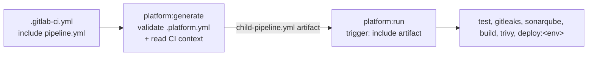

# pipeline-platform

[](https://github.com/ftonita/pipeline-platform/actions)

-FFEC6E?logo=vault&logoColor=black)


**One `.platform.yml` per repository. A generated GitLab child pipeline with only the jobs that apply to the current ref.**

```yaml
# .gitlab-ci.yml: the whole pipeline definition of a service
include:
  - project: platform/pipeline-platform
    ref: v1
    file: pipeline.yml
```

A service repo declares *what* it needs (registry, tests, quality gates, deploy targets) in `.platform.yml`. The platform decides *how*: it validates the file against a JSON Schema, generates a child pipeline for the current commit, and GitLab runs it.

> **Everything here is synthetic.** Hosts, paths, projects and names are fictional (`example.com`). It is a reference design inspired by pipeline standardisation work, not code from any employer. See [What is verified](#what-is-verified) for exactly what was and was not tested.

## Features

| | |
|---|---|
| **Single config** | `.platform.yml` (schema `v1`), validated with readable errors such as `deploy.environments[1].argocd: 'gitops_repo' is a required property`. |
| **Conditional jobs** | Merge request, default branch, feature branch and tag pipelines each get a different set of jobs, decided at generation time. |
| **Vault without static tokens** | GitLab `id_tokens` (JWT) + native `secrets:`. Secrets are references, never values. |
| **Image tag = commit SHA** | `registry/ns/app:$CI_COMMIT_SHORT_SHA`, built by Kaniko (no privileged runner), pushed to **Nexus**; **Artifactory** optional. |
| **Deploy of your choice** | Per environment: **Ansible**, **Helm** or **ArgoCD** (GitOps commit + optional sync wait). |
| **Quality gates** | Gitleaks, SonarQube (quality gate wait), Trivy (HIGH/CRITICAL) before anything is deployed. |
| **Versioned** | `v1` moving tag, immutable `v1.x.y`, [CHANGELOG](CHANGELOG.md), [release process](RELEASING.md). |

## How it works



Why generate instead of using `rules:` in a static file? Inside a child pipeline `CI_PIPELINE_SOURCE` is `parent_pipeline`, so merge-request rules cannot work there. The generator reads the *parent's* context and emits only the jobs that apply, which also makes the result deterministic and easy to review (golden files in [`examples/consumer-app/expected`](examples/consumer-app/expected)).

### Which jobs run

| Context | test | gitleaks | sonarqube | build | trivy | deploy |
|---|:-:|:-:|:-:|:-:|:-:|:-:|
| Merge request | yes | yes | yes | verify only (`--no-push`) | no | no |
| Default branch | yes | yes | yes | push | yes | envs whose `refs.branches` match |
| Other branch | yes | yes | no | push only if an env matches | if pushed | envs whose `refs.branches` match (glob) |
| Tag | yes | yes | no | push (+ `:<tag>`) | yes | envs whose `refs.tags` regex matches |
| Anything else | | | | | | `noop` job (an empty child pipeline would fail) |

## Quick start

```bash
pip install .                            # or use the container image built from the Dockerfile
cp examples/consumer-app/argocd.platform.yml .platform.yml
pipeline-platform validate               # exit 2 + list of problems if invalid
CI_COMMIT_BRANCH=main CI_DEFAULT_BRANCH=main pipeline-platform generate --out -
```

### Configuration reference (v1)

| Key | Required | Notes |
|---|:-:|---|
| `version` | yes | Must be `1`. |
| `app.name` | yes | DNS-label style, used in the image path and release names. |
| `vault.url`, `vault.role` | yes | `https://` only. Optional `auth_path` (default `jwt`), `audience` (default: `vault.url`). |
| `registry.host`, `namespace`, `credentials` | yes | `type: nexus` (default) or `artifactory` (+ `repository`, `layout: path\|subdomain`). |
| `build` | no | `enabled`, `dockerfile`, `context`, `args`. |
| `test` | no | `image`, `script[]`, `junit`. |
| `quality` | no | `gitleaks`, `trivy` (default on), `sonarqube {host_url, token}`. |
| `deploy.environments[]` | no | `name`, `method`, `refs {branches[], tags}`, `approval: auto\|manual`, `secrets{ENV: ref}` and one of `ansible` / `helm` / `argocd`. |
| `images` | no | Override tool images, e.g. internal mirrors. |

The authoritative definition is [`platform.v1.schema.json`](src/pipeline_platform/schemas/platform.v1.schema.json); add the `yaml-language-server` comment from the examples for editor completion. Gotcha handled by design: the key is `refs`, not `on`, because YAML 1.1 parses an unquoted `on:` as boolean `true`.

### Deploy methods

| Method | What the job does |
|---|---|
| `ansible` | `ansible-playbook -i <inventory> <playbook> -e image=$IMAGE -e image_tag=$IMAGE_TAG` with the SSH key fetched from Vault as a file. |
| `helm` | `helm upgrade --install --atomic` with `image.repository` / `image.tag` set, kubeconfig from Vault as a file. |
| `argocd` | Clones the GitOps repo, runs `pipeline-platform bump-tag` on `apps/<app>/<env>/values.yaml`, commits and pushes (with rebase retry). Optional `sync` waits for ArgoCD to report `Healthy` and `Synced`. Layout: [`examples/gitops-repo`](examples/gitops-repo). |

### Vault side (one-time, per platform)

```bash
vault auth enable jwt
vault write auth/jwt/config jwks_url="https://gitlab.example.com/-/jwks" bound_issuer="https://gitlab.example.com"
vault write auth/jwt/role/ci-orders-api - <<'JSON'
{ "role_type": "jwt", "user_claim": "project_path", "policies": ["orders-api-ci"],
  "bound_audiences": ["https://vault.example.com"], "token_explicit_max_ttl": 900,
  "bound_claims_type": "glob", "bound_claims": { "project_path": "shop/orders-api", "ref_protected": "true" } }
JSON
```
Binding the role to `project_path` and `ref_protected` means a fork or an unprotected branch cannot obtain deploy credentials.

## Versioning

- `version: 1` in `.platform.yml` always matches the platform major version.
- Consumers use `ref: v1` (moving, receives compatible fixes) or `ref: v1.0.0` (immutable).
- A breaking change ships as `v2` with its own schema file; `v1` keeps working. See [RELEASING.md](RELEASING.md) and [CHANGELOG.md](CHANGELOG.md).

## What is verified

Verified in the author's sandbox (reproduce with `pip install -e ".[dev]" && pytest`):

- 135 tests, 99% line coverage: schema accept/reject cases, context detection, job selection for every context, Vault wiring, registry layouts, all three deploy methods, shell-quoting of user input, CLI exit codes and golden-file comparison of 12 generated pipelines.
- All 12 generated pipelines, the entrypoint `pipeline.yml` and the consumer `.gitlab-ci.yml` validate against **GitLab's official CI JSON Schema** (`GITLAB_CI_SCHEMA`, fetched from gitlab.com).
- `ruff check` is clean.

**Not** verified (no GitLab, Vault, Nexus, Kubernetes or Docker daemon was available):

- Execution on a real GitLab runner, including the dynamic child pipeline hand-off.
- Real Vault JWT login, Nexus/Artifactory pushes, Kaniko builds, Trivy/Sonar runs.
- `docker build` of the [Dockerfile](Dockerfile) (the ArgoCD CLI download is unexercised).
- `helm lint` / `helm template` / ArgoCD on `examples/gitops-repo`. These run in this repo's GitHub Actions workflow (`gitops-example` job) on every push.

Expect to adjust runner tags, network policy and image mirrors for your environment.

## Layout

```
pipeline.yml                 entrypoint included by consumers
src/pipeline_platform/       schema, config defaults, context, generator, gitops, cli
tests/                       unit, golden and GitLab-schema tests
examples/consumer-app/       argocd / helm / ansible configs + expected generated pipelines
examples/gitops-repo/        Helm chart, per-env values, ArgoCD ApplicationSet
Dockerfile                   image used by platform:generate and the ArgoCD job
```
