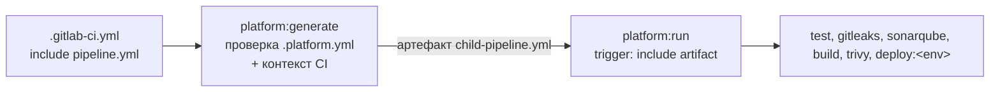

<p align="right"><a href="README.md">🇬🇧 English</a> · 🇷🇺 <b>Русский</b></p>

# pipeline-platform

[](https://github.com/ftonita/pipeline-platform/actions)


**Готовые CI/CD-модули для GitLab CI и Jenkins: Vault, Nexus, Artifactory, Docker-образы, Ansible. Несколько строк и минимум параметров на репозиторий.**

```yaml
# GitLab: весь .gitlab-ci.yml репозитория с Ansible-ролью
include:
  - project: platform/pipeline-platform
    ref: v1
    file: [gitlab/ansible.yml, gitlab/ansible-role.yml]
variables:
  ANSIBLE_INVENTORY: tests/inventory
```
```groovy
// Jenkins: весь Jenkinsfile того же репозитория
@Library('pipeline-platform@v1') _
ansibleRolePipeline(role: 'motd', inventory: 'tests/inventory')
```

> **Всё здесь синтетическое.** Хосты, пути, проекты и имена вымышлены (`example.com`). Это эталонный дизайн, а не код какого-либо работодателя. Что именно проверено и что нет, смотрите в разделе [Что проверено](#что-проверено).

## Идея: три слоя, как матрёшка

Каждый внешний слой собран из внутреннего, поэтому исправление в одном месте доходит до всех.

| Слой | Что это | Когда использовать |
|---|---|---|
| **1. Модули** | Небольшие переиспользуемые части: `Vault`, `Nexus`, `Artifactory`, `Docker-образ`, `Ansible`. GitLab: скрытые джобы, подключаемые через `extends:`. Jenkins: шаги, которые вы вызываете. | У вас свой пайплайн, нужно добавить одну возможность. |
| **2. Готовые пайплайны** | Пайплайны целиком из модулей: *репозиторий Ansible-роли*, *репозиторий Ansible-плейбуков*. | Ваш репозиторий — один из этих. Подключаете один файл, задаёте одну переменную. |
| **3. Полная платформа** (только GitLab) | `.platform.yml` → сгенерированный дочерний пайплайн с тестами, проверками качества, сборкой образа и деплоем. См. [Полная платформа](#полная-платформа-platformyml-gitlab). | Репозитории приложений со стандартным полным потоком. |

В основе всего один маленький инструмент — [`resources/pp.py`](resources/pp.py) (`pp vault export`, `pp nexus put`, `pp artifactory get`, ...). Поэтому GitLab и Jenkins ведут себя одинаково, а логика существует в одном экземпляре. Это обычный Python без зависимостей, покрытый тестами.

```
 ваш репозиторий ──► Готовый пайплайн ──► Модули ──► pp.py (Vault, Nexus, Artifactory)
                       GitLab: gitlab/*.yml           Jenkins: vars/*.groovy
```

### Что подключить?

| Я хочу... | GitLab (`include: file:`) | Jenkins (`@Library`) |
|---|---|---|
| Линт, проверку и применение для репозитория **Ansible-роли** | `gitlab/ansible.yml` + `gitlab/ansible-role.yml` | `ansibleRolePipeline(...)` |
| Линт, проверку и применение для репозитория **плейбуков** | `gitlab/ansible.yml` + `gitlab/ansible-playbook.yml` | `ansiblePlaybookPipeline(...)` |
| Запустить свой плейбук или роль в своём пайплайне | `.ansible-playbook`, `.ansible-role` | `ansibleRun(...)`, `ansibleRole(...)` |
| Получить **секреты из Vault** (KV, динамические, любая аутентификация) | `.vault` (нативно) или `.vault-export` | `vaultSecrets(...) { ... }` |
| Загрузить / скачать файлы в **Nexus** | `gitlab/nexus.yml`: `.nexus-put`, `.nexus-get` | `nexusPut(...)`, `nexusGet(...)` |
| Загрузить / скачать файлы в **Artifactory** | `gitlab/artifactory.yml`: `.artifactory-put`, `.artifactory-get` | `artifactoryPut(...)`, `artifactoryGet(...)` |
| Собрать и отправить **Docker-образ** в любой из них | `gitlab/docker.yml`: `.kaniko-build` | `dockerBuildPush(...)` |
| Весь стандартный поток для приложения | `pipeline.yml` + `.platform.yml` | недоступно (только GitLab) |

## Старт за 5 минут

### Разовая настройка (команда платформы, один раз на компанию)

**GitLab**
1. Положите этот репозиторий в GitLab как `platform/pipeline-platform` с видимостью *internal* (потребители читают его через `include:project`). Выпустите релиз с тегом `v1` (см. [RELEASING.md](RELEASING.md)).
2. Соберите и отправьте образ инструмента: `docker build -t registry.example.com/platform/pipeline-platform:v1 . && docker push ...`. В нём есть `pp`, Python и git. Потребители указывают его переменной `PLATFORM_IMAGE` (по умолчанию именно это имя).
3. На **группе** GitLab задайте CI/CD-переменные `VAULT_SERVER_URL` и `VAULT_AUTH_ROLE` (нужны только для Vault).

**Jenkins**: *Manage Jenkins → System → Global Trusted Pipeline Libraries → Add*: имя `pipeline-platform`, версия по умолчанию `v1`, источник Git → этот репозиторий. На агентах нужен `python3` (и `ansible`, `docker` для шагов, которые их используют) либо запускайте стадии в контейнерах (готовые пайплайны так и делают).

**Vault** (только если используете): см. [Настройка Vault](#настройка-vault-один-раз).

### В репозитории (все остальные)

1. Выберите строку из таблицы выше.
2. Скопируйте подходящий пример и поменяйте переменные:

| Тип репозитория | GitLab | Jenkins |
|---|---|---|
| Ansible-роль | [`examples/gitlab/ansible-role`](examples/gitlab/ansible-role) | [`Jenkinsfile.ansible-role`](examples/jenkins/Jenkinsfile.ansible-role) |
| Ansible-плейбуки | [`examples/gitlab/ansible-playbook`](examples/gitlab/ansible-playbook) | [`Jenkinsfile.ansible-playbook`](examples/jenkins/Jenkinsfile.ansible-playbook) |
| Набор модулей (образ, Nexus, Artifactory, Vault) | [`examples/gitlab/blocks`](examples/gitlab/blocks) | [`Jenkinsfile.blocks`](examples/jenkins/Jenkinsfile.blocks) |

3. Откройте merge request. Линт и проверка синтаксиса запустятся сами; пробный прогон и *ручное* применение появятся, как только вы зададите inventory.

## Модули

Переменные каждого модуля описаны в первых строках его файла. Кратко:

### Vault

| | GitLab | Jenkins |
|---|---|---|
| **Просто (KV v2)** | `extends: .vault` + `secrets: ИМЯ: { vault: путь/поле@mount }`. Значение получает сам GitLab, нигде оно не сохраняется. | |
| **Любой движок, любая аутентификация, передача в следующие джобы** | `extends: .vault-export` с `VAULT_ENV` / `VAULT_FILES` (строки `ИМЯ=спецификация`); следующие джобы указывают её в `needs:` и получают переменные. | `vaultSecrets(url:, credentialsId:, env: [...], files: [...]) { ... }` |
| Аутентификация | JWT (ID-токен GitLab, по умолчанию), AppRole (`VAULT_ROLE_ID` + `VAULT_SECRET_ID`), токен (`VAULT_TOKEN`); выбирается автоматически | AppRole (`credentialsId`) или токен (`tokenId`) |

Спецификация секрета: `[движок:]mount/путь#поле`

| движок | значение | пример |
|---|---|---|
| `kv2:` (по умолчанию) | KV v2 (`/data/` добавляется сам) | `ci/nexus/docker#password` |
| `kv1:` | KV v1 | `kv1:legacy/nexus#password` |
| `raw:` | любой другой движок, полный путь API | `raw:database/creds/ro#username`, `raw:aws/creds/deploy#access_key` |

Несколько полей одного пути читаются одним запросом, поэтому динамические учётные данные остаются согласованными. `VAULT_FILES` / `files:` кладут значение в файл с правами `0600` и отдают вам путь к нему; используйте для SSH-ключей, kubeconfig, сертификатов и любых многострочных значений.

### Nexus, Artifactory

| | GitLab | Jenkins |
|---|---|---|
| Загрузка | `extends: .nexus-put` с `NEXUS_URL`, `NEXUS_REPO`, `NEXUS_FILES` (маски допустимы); так же `.artifactory-put` | `nexusPut(url:, repo:, files:, dest:, credentialsId:)`, `artifactoryPut(... tokenId:)` |
| Скачивание | `.nexus-get`: `NEXUS_REPO`, `NEXUS_PATH`; `.artifactory-get` | `nexusGet(repo:, path:, out:)`, `artifactoryGet(...)` |
| Учётные данные | `NEXUS_USER` + `NEXUS_PASSWORD` (замаскированные CI/CD-переменные или из Vault); `ARTIFACTORY_USER` + `ARTIFACTORY_PASSWORD` или `ARTIFACTORY_TOKEN` | Credentials Jenkins: `credentialsId` (логин/пароль); `tokenId` (secret text) — для Artifactory |

Файлы загружаются в `<dest>/<имя файла>`. В GitLab `dest` по умолчанию — `<проект>/<тег или коммит>`; в Jenkins без `dest` файл попадает в корень репозитория. Загрузки в Artifactory дополнительно отправляют контрольную сумму SHA-1 и свойства `build` и `vcs.revision`. Работает для raw-, generic- и maven-репозиториев: кладите файл туда, где его ожидает раскладка.

### Docker-образ (реестр Nexus или Artifactory)

GitLab: `extends: .kaniko-build` с `REGISTRY_HOST`, `IMAGE_NAME`, `REGISTRY_USER`, `REGISTRY_PASSWORD` (Kaniko: без Docker-демона и привилегированного раннера). Jenkins: `dockerBuildPush(registry:, image:, credentialsId:)`. Тег — короткий SHA коммита; в пайплайнах по тегу дополнительно отправляется Git-тег.

### Ansible

| | GitLab | Jenkins |
|---|---|---|
| Роль из этого репозитория | `.ansible-role` (+ `-check`, `-syntax`) | `ansibleRole(role:, inventory:, hosts:)` |
| Плейбук | `.ansible-playbook` (+ `-check`, `-syntax`) | `ansibleRun(playbook:, inventory:)` |
| Линт | `.ansible-lint` | `ansibleLint()` |
| Переменные | `ANSIBLE_INVENTORY`, `ANSIBLE_PLAYBOOK`, `ANSIBLE_HOSTS`, `ANSIBLE_ARGS` | `inventory`, `playbook`, `hosts`, `args: [...]` |
| SSH-ключ | File-переменная или файл из Vault с именем `ANSIBLE_PRIVATE_KEY_FILE` (Ansible читает её сам) | `sshKeyId: '<credential>'` |

Модуль роли подключает репозиторий как роль и генерирует плейбук из двух строк (`hosts` + эта роль), так что роль проверяется ровно так, как её применяют. `requirements.yml` в корне репозитория ставится автоматически. Ключи хостов проверяются: передайте `SSH_KNOWN_HOSTS` (вывод `ssh-keyscan host`) или, только в лаборатории, `ANSIBLE_HOST_KEY_CHECKING=false`.

## Рецепты

**Секреты из Vault в загрузку в Nexus (GitLab)**: см. [`examples/gitlab/blocks`](examples/gitlab/blocks).

```yaml
nexus:upload:
  extends: [.vault, .nexus-put]
  variables: { NEXUS_URL: https://nexus.example.com, NEXUS_REPO: raw-releases, NEXUS_FILES: "dist/*.tgz" }
  secrets:
    NEXUS_USER:     { vault: nexus/ci/username@ci, file: false }   # путь/поле@mount
    NEXUS_PASSWORD: { vault: nexus/ci/password@ci, file: false }
```

**Передать секреты в следующие джобы (GitLab)**: одна джоба читает, остальные используют.

```yaml
vault:export:
  extends: .vault-export
  variables:
    VAULT_ENV: |
      DB_PASSWORD=raw:database/creds/orders-ro#password
    VAULT_FILES: |
      KUBECONFIG=ci/k8s/prod#kubeconfig
deploy:
  needs: [vault:export]      # $DB_PASSWORD, а $KUBECONFIG = путь к файлу
  script: [kubectl get pods]
```
Лучше использовать `.vault` в каждой джобе, которой нужен секрет: тогда ничего не сохраняется. Артефакт передачи ограничен (`access: none`, 1 час), но значения в нём всё же лежат; применяйте его, когда нужен движок или способ аутентификации, которых `.vault` не умеет.

**Секреты из Vault в Jenkins**: оберните стадии, которым они нужны.

```groovy
vaultSecrets(url: 'https://vault.example.com', credentialsId: 'vault-approle',
             env: [DB_PASSWORD: 'raw:database/creds/orders-ro#password']) {
    sh 'migrate.sh'          // одинарные кавычки: $DB_PASSWORD читает shell, а не Groovy
}
```

**SSH-ключ из Vault для Ansible (GitLab)**: переопределите джобу в своём `.gitlab-ci.yml`, GitLab объединит описания:

```yaml
ansible-role:apply:
  extends: .vault
  secrets:
    ANSIBLE_PRIVATE_KEY_FILE:
      vault: { engine: { name: kv-v2, path: ci }, path: ssh/deploy, field: private_key }
      file: true
```

## Полезно знать

| Симптом | Причина и решение |
|---|---|
| Мой `script:` заменил шаги шаблона | `extends` заменяет списки (`script`, `before_script`, `rules`). Скопируйте нужные строки или используйте `!reference [.ansible, before_script]`. |
| Заданная глобально переменная игнорируется | Переменные внутри джобы сильнее глобальных. Поэтому в модулях значения по умолчанию лежат в скрипте (`${VAR:-default}`) и ваши глобальные значения побеждают. В своих джобах делайте так же. |
| В переменной с паролем лежит путь к файлу | `secrets:` в GitLab по умолчанию работают с `file: true`. Для значений (пароли, токены) добавляйте `file: false`; для ключей и kubeconfig оставляйте `true`. |
| `Host key verification failed` | Задайте `SSH_KNOWN_HOSTS` (см. выше). |
| Vault: `permission denied` / несовпадение audience | Роль Vault должна разрешать ваш проект, а `bound_audiences` равняться `VAULT_SERVER_URL`. |
| Джоба названа `image`, `stages`, `variables`... | Это ключевые слова GitLab, а не имена джоб. |
| Значение секрета видно в логе Jenkins | Jenkins не умеет маскировать значения из `vaultSecrets`. Никогда не печатайте их через `echo` и не запускайте `sh` с `set -x`; где важна маскировка, используйте credentials Jenkins. |

## Безопасность

- Никаких статических токенов Vault: ID-токены GitLab (JWT) или AppRole. Сессия Vault, созданная `pp`, отзывается в конце.
- Секреты читаются из окружения, а не из командной строки; `pp` печатает имена переменных, не значения; файлы создаются с правами `0600` в каталоге `0700`.
- `pp` отказывается работать по `http://`, не пересылает учётные данные на другой хост при редиректах и использует системное хранилище сертификатов (`SSL_CERT_FILE` для частного CA).
- Образы инструментов зафиксированы по версиям; библиотека Jenkins фиксируется через `@v1` (или `@v1.x.y`).
- `vault.env` и `.vault-files/` внесены в `.gitignore`. Запускайте Gitleaks (входит в полную платформу) в своих пайплайнах.

## Полная платформа: `.platform.yml` (GitLab)

Для репозиториев приложений, следующих полному потоку. Сервис объявляет, *что* ему нужно, платформа решает, *как*: проверяет `.platform.yml` по JSON Schema, генерирует дочерний пайплайн для текущего коммита, и GitLab его запускает.

```yaml
# .gitlab-ci.yml
include:
  - project: platform/pipeline-platform
    ref: v1
    file: pipeline.yml
```



Зачем генерировать, а не использовать `rules:` в статическом файле? Внутри дочернего пайплайна `CI_PIPELINE_SOURCE` равен `parent_pipeline`, поэтому правила для merge request там не работают. Генератор читает контекст *родителя* и выдаёт только подходящие джобы; результат детерминирован и удобен для ревью (эталонные файлы в [`examples/consumer-app/expected`](examples/consumer-app/expected)).

| Контекст | test | gitleaks | sonarqube | build | trivy | deploy |
|---|:-:|:-:|:-:|:-:|:-:|:-:|
| Merge request | да | да | да | только проверка (`--no-push`) | нет | нет |
| Ветка по умолчанию | да | да | да | push | да | окружения, где совпал `refs.branches` |
| Другая ветка | да | да | нет | push, только если подошло окружение | если был push | окружения, где совпал `refs.branches` (glob) |
| Тег | да | да | нет | push (+ `:<тег>`) | да | окружения, где совпало регулярное выражение `refs.tags` |
| Всё остальное | | | | | | джоба `noop` (пустой дочерний пайплайн завершился бы ошибкой) |

```bash
pip install .                            # или образ, собранный из Dockerfile
cp examples/consumer-app/argocd.platform.yml .platform.yml     # затем отредактируйте
pipeline-platform validate               # код 2 и список проблем, если файл неверный
CI_COMMIT_BRANCH=main CI_DEFAULT_BRANCH=main pipeline-platform generate --out -
```

### Справочник конфигурации (v1)

| Ключ | Обязателен | Примечания |
|---|:-:|---|
| `version` | да | Должен быть `1`. |
| `app.name` | да | В стиле DNS-метки, используется в пути образа и именах релизов. |
| `vault.url`, `vault.role` | да | Только `https://`. Дополнительно `auth_path` (по умолчанию `jwt`), `audience` (по умолчанию `vault.url`). |
| `registry.host`, `namespace`, `credentials` | да | `type: nexus` (по умолчанию) или `artifactory` (+ `repository`, `layout: path\|subdomain`). |
| `build` | нет | `enabled`, `dockerfile`, `context`, `args`. |
| `test` | нет | `image`, `script[]`, `junit`. |
| `quality` | нет | `gitleaks`, `trivy` (включены по умолчанию), `sonarqube {host_url, token}`. |
| `deploy.environments[]` | нет | `name`, `method`, `refs {branches[], tags}`, `approval: auto\|manual`, `secrets{ENV: ref}` и один из `ansible` / `helm` / `argocd`. |
| `images` | нет | Переопределение образов инструментов, например внутренними зеркалами. |

Авторитетное описание — [`platform.v1.schema.json`](src/pipeline_platform/schemas/platform.v1.schema.json); добавьте комментарий `yaml-language-server` из примеров, чтобы редактор подсказывал поля. Ключ называется `refs`, а не `on`, потому что YAML 1.1 читает `on:` без кавычек как булево `true`.

| Способ деплоя | Что делает джоба |
|---|---|
| `ansible` | `ansible-playbook -i <inventory> <playbook> -e image=$IMAGE -e image_tag=$IMAGE_TAG`, SSH-ключ берётся из Vault как файл. |
| `helm` | `helm upgrade --install --atomic` с `image.repository` / `image.tag`, kubeconfig из Vault как файл. |
| `argocd` | Клонирует GitOps-репозиторий, запускает `pipeline-platform bump-tag` для `apps/<app>/<env>/values.yaml`, делает коммит и push (с повтором через rebase). Необязательный `sync` ждёт, пока ArgoCD сообщит `Healthy` и `Synced`. Раскладка: [`examples/gitops-repo`](examples/gitops-repo). |

## Настройка Vault (один раз)

GitLab (JWT). Привязка роли к `project_path` и `ref_protected` означает, что форк или незащищённая ветка не получат учётные данные деплоя:

```bash
vault auth enable jwt
vault write auth/jwt/config jwks_url="https://gitlab.example.com/-/jwks" bound_issuer="https://gitlab.example.com"
vault policy write orders-api-ci - <<'HCL'
path "ci/data/nexus/*" { capabilities = ["read"] }          # KV v2: обратите внимание на /data/
path "database/creds/orders-ro" { capabilities = ["read"] }
HCL
vault write auth/jwt/role/ci-orders-api - <<'JSON'
{ "role_type": "jwt", "user_claim": "project_path", "policies": ["orders-api-ci"],
  "bound_audiences": ["https://vault.example.com"], "token_explicit_max_ttl": 900,
  "bound_claims_type": "glob", "bound_claims": { "project_path": "shop/orders-api", "ref_protected": "true" } }
JSON
```

Jenkins (AppRole): создайте `auth/approle/role/ci-jenkins` с той же политикой, затем сохраните его `role_id` / `secret_id` в credential Jenkins типа *Username with password* (его имя передаётся как `credentialsId`).

## Версионирование

- `version: 1` в `.platform.yml` всегда совпадает с мажорной версией платформы.
- Потребители используют `ref: v1` / `@v1` (подвижный тег, получает совместимые исправления) или `v1.x.y` (неизменяемый).
- Ломающее изменение выходит как `v2`; `v1` продолжает работать. См. [RELEASING.md](RELEASING.md) и [CHANGELOG.md](CHANGELOG.md).

## Что проверено

Воспроизведение: `pip install -e ".[dev]" ansible-core ansible-lint && pytest` (чтобы включить тесты по схеме GitLab и Jenkins, задайте `GITLAB_CI_SCHEMA` и `GROOVY_CP`, см. заголовки тестовых файлов).

- `pp.py` против фейкового сервера Vault, Nexus и Artifactory: вход по JWT / AppRole / токену, KV v1/v2 и динамические движки, одно чтение на путь, отзыв токена, многострочные значения, редиректы без учётных данных, сообщения об ошибках без секретов.
- Шаблоны GitLab и все примеры проходят проверку по **официальной JSON-схеме GitLab CI**; все `extends` разрешаются; скрипты модулей Nexus / Artifactory выполняются с подставным `pp`; модули Ansible для роли и плейбука **выполняются по-настоящему** (`ansible-playbook` на localhost: пробный прогон ничего не меняет, применение идемпотентно); примеры проходят `ansible-lint`.
- Шаги Jenkins компилируются и **выполняются настоящим Groovy** с подставной реализацией DSL пайплайна, против тех же фейковых серверов, настоящего shell и настоящего Ansible (работа с секретами, экранирование, очистка).
- Полная платформа: допустимые и недопустимые схемы, определение контекста, выбор джоб для каждого контекста, все три способа деплоя, эталонные файлы 12 сгенерированных пайплайнов. Проверено в GitHub Actions (первый запуск 2026-10-09, до добавления модулей): тесты на Python 3.10 и 3.12, `helm lint`, `helm template` и `kubeconform -strict` на примере чарта.

**Не** проверено (не было GitLab, Jenkins, Vault, Nexus, Artifactory, Kubernetes и Docker-демона):

- Выполнение на настоящем раннере GitLab (включая `id_tokens`, передачу `needs` + dotenv и динамический дочерний пайплайн) и на настоящем Jenkins (правила CPS/sandbox Groovy, Docker-агенты, привязка credentials).
- Настоящие серверы Vault / Nexus / Artifactory, сборки Kaniko, запуски Trivy / Sonar.
- `docker build` для [Dockerfile](Dockerfile), синхронизация `examples/gitops-repo` в ArgoCD.

Теги раннеров, сетевые политики и зеркала образов придётся подстроить под вашу среду.

## Структура

```
gitlab/                      модули и готовые пайплайны GitLab (vault, nexus, artifactory, docker, ansible*)
vars/                        шаги общей библиотеки Jenkins (+ resources/ ниже, по соглашению Jenkins)
resources/pp.py              общий инструмент: Vault, Nexus, Artifactory (только стандартная библиотека)
pipeline.yml                 точка входа GitLab для полной платформы
src/pipeline_platform/       полная платформа: схема, значения по умолчанию, контекст, генератор, gitops, cli
examples/gitlab/             примеры: роль, плейбук, набор модулей
examples/jenkins/            соответствующие Jenkinsfile
examples/consumer-app/       варианты .platform.yml + ожидаемые сгенерированные пайплайны
examples/gitops-repo/        Helm-чарт, значения по окружениям, ArgoCD ApplicationSet
tests/                       pp, шаблоны GitLab, шаги Jenkins, генератор
Dockerfile                   образ инструмента: pp, python, git, argocd
```
